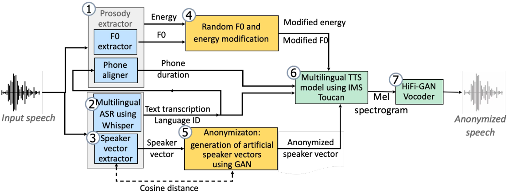

# STTTS-Multi Pipeline

The STTTS-Multi (short for multilingual Speech-to-Text-to-Speech) voice anonymization pipeline is a multilingual extension of the STTTS
(baseline B3 of track 1) system.
For a description of B3, please check the [readme of B3](../sttts/readme_sttts_pipeline.md) and the corresponding publications
([1](https://www.isca-archive.org/interspeech_2022/meyer22b_interspeech.pdf), [2](https://ieeexplore.ieee.org/abstract/document/10022601), [3](https://ieeexplore.ieee.org/abstract/document/10096607)). 
The key additions of the multilingual approach were proposed in [this paper](https://www.isca-archive.org/interspeech_2024/meyer24_interspeech.html). 
The code in this pipeline slightly extends this paper by using a more current multilingual TTS system which was proposed in [this paper](https://www.isca-archive.org/interspeech_2024/lux24_interspeech.html).

This pipeline is used as the basis for the baselines BM2 and BM3 of track 2 of VPC 2026.
As in STTTS, the key ideas of this pipeline are to reduce the linguistic content of the input speech to text transcriptions that
reveal as little information about the speaker as possible, generate artificial target speakers using a generative adversarial network (GAN), 
and to synthesize the anonymized speech based on the unmodified transcription, slightly modified representations of the input speech's prosody, and the artificial speaker embedding.
Compared to STTTS, the ASR model in STTTS-Multi consists of the pre-trained multilingual [Whisper-large-v3](https://huggingface.co/openai/whisper-large-v3) model. 
Instead of phonetic transcriptions, this model encodes the linguistic content as orthographic text transcriptions.
Furthermore, it accepts a language tag which will be used as language ID throughout the pipeline.
The TTS model and HiFiGAN vocoder are replaced by multilingual counterparts as given in the [IMS Toucan toolkit](https://github.com/DigitalPhonetics/IMS-Toucan) and as described in the [corresponding paper](https://www.isca-archive.org/interspeech_2024/lux24_interspeech.html).
As this TTS model uses ECAPA-TDNN embeddings as input for speaker information, the speaker anonymization module in STTTS-Multi deviates slightly from STTTS in that it uses a ECAPA-TDNN extractor instead of the previous GST-based one.
The GAN model for generated artificial speaker embeddings is also updated accordingly.

The only difference between BM2 and BM3 is that BM3 skips the prosody extraction and anonymization phase.
Instead, the prosody for speech synthesis is estimated based on the text transcript.
This reduces the utility of the model in terms of emotion preservation but improves the general privacy preservation.

The implementations of this system are based on [https://github.com/DigitalPhonetics/speaker-anonymization](https://github.com/DigitalPhonetics/speaker-anonymization) and [https://github.com/DigitalPhonetics/VoicePAT](https://github.com/DigitalPhonetics/VoicePAT).

## Modules
The pipeline consists of four modules:

### Speech Recognition
We use the pre-trained [Whisper-v3-large](https://huggingface.co/openai/whisper-large-v3) to recognize the spoken transcript, which is then used as the representation of linguistic information.
The model is automatically downloaded during execution. 
The recognition can be performed by either giving the gold label of the language of the speech together with the audio as input to the model, or by letting it perform the language recognition on its own.
In both systems, BM2 and BM3, we use the gold label per default. If you want to change that and perform language recognition instead, you can set `gold_langs=false` in the anon configs of BM2 and BM3.
Note that in contrast to the ASR model used in B3 of track 1, the outputs of Whisper are orthographic transcriptions instead of phonetic ones. 

### Prosody Extraction and Modification
This module is only used in the baseline BM2. It is identical to the corresponding module in B3.
The prosody of the input speech is extracted on the phone level with three values per phone: pitch (F0), energy, and duration.
This results in three 1-dimensional vectors for pitch, energy and duration.
The pitch and energy values are normalized by the mean of the utterance's values in order to remove speaker-specific values.
In this way, the extracted prosody can directly be used as input to the speech synthesis, regardless of the speaker's gender or age.
However, the prosody contour might still reveal some information about the speaker.
Therefore, it is possible to randomly modify the pitch and energy values of each phone by multiplying them with a random value within a given range (offsets).
This range usually centers around 100 (%), and a different value is samples within that range for each phone.
In the default config, we use a range of [60, 140] which indicate percentages. 
This means that each value can be reduced to up to 60% of its original value or increased to up to 140%.
It is also possible that a value is not changed at all if 100% is sampled as its random offset.
The random modification removes speaker-specific patterns while avoiding to change the prosody and thus the conveyed meaning of the original utterance too much.

### Speaker Embedding Extraction and Modification
The speaker information is extracted from the input speech as an ECAPA-TDNN speaker embedding, for which the [pretrained model of SpeechBrain](https://huggingface.co/speechbrain/spkrec-ecapa-voxceleb) (trained on VoxCeleb) is used. 
The anonymization of this speaker information is performed using a Wasserstein GAN which generates the artificial target speakers for the anonymized speech.
The generated embeddings do not correspond to real speakers, and since the GAN was not trained directly on original speaker embeddings but only on their distribution, it is unlikely that the GAN imitates the training speakers.
During anonymization of an utterance, the GAN either generates a new embedding or samples one randomly from a set of pre-generated embeddings.
If this speaker embedding is too similar to the original speaker (cosine distance < 0.3), a new speaker embedding is sampled.
Note that this model is in function and architecture identical to the one used in B3 but trained as a new model because of the switch of speaker embedding types from GST (in B3) to ECAPA-TDNN (in BM2 and BM3).

### Speech Synthesis
The speech synthesis module consists of a FastSpeech2-based Text-to-Speech (TTS) model and a HiFiGAN vocoder.
It is implemented in the [IMS Toucan toolkit](https://github.com/DigitalPhonetics/IMS-Toucan) which we include as copy in this repository and proposed in [this paper](https://www.isca-archive.org/interspeech_2024/lux24_interspeech.html).
The TTS transforms the text sequence first into phonetic sequences and then into articulatory features, and uses them together with the prosody sequences and artificial speaker embedding to generate the output spectrogram.
In BM2, the prosodic information is taken from the output of the prosody modification module.
In BM3, pitch, energy and duration of each phone are predicted from the text transcripts and therefore constitute plausible prosody contours but do not correspond to the original intonation.
The language ID taken from the output of the speech recognition module is used to select the appropriate phonemizer and language embedding for the speech synthesis.
The vocoder then transforms the generated spectrogram into the anonymized waveform.

## Usage
This pipeline can be run by specifying the [anon_BM2.yaml](../../../configs/track2/anon_BM2.yaml) or [anon_BM3.yaml](../../../configs/track2/anon_BM3.yaml) configurations for the anonymization.
Please be aware that, depending on the size of your dataset, the anonymization can take some time.
Intermediate representations of all modules are saved to disk.
If the pipeline is run a second time, the intermediate representations will be loaded by default, and only recomputed if explicitly specified in order to reduce the run time.
